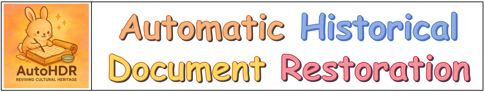
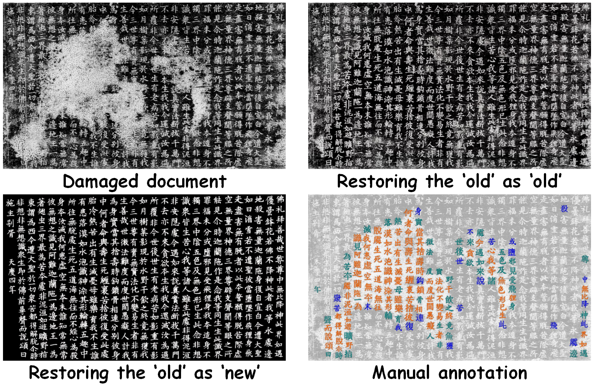

<div align=center>

# Reviving Cultural Heritage: A Novel Approach for Comprehensive Historical Document Restoration

</div>

 

<div align=center>

[](https://arxiv.org/abs/2507.05108) 
[](http://121.41.49.212:8432/)
[](https://github.com/ZZXF11)
[](http://dlvc-lab.net/lianwen/)
[](https://github.com/SCUT-DLVCLab/AutoHDR)
<!-- []([https://](https://github.com/SCUT-DLVCLab/AutoHDR)) -->

</div>

## 🌟 Highlights
- AutoHDR

- FPHDR dataset

- We propose a novel fully Automated solution for HDR **(AutoHDR)** , inspired by mirroring the workflow of expert historians.
- We introduce a pioneer Full-Page HDR dataset **(FPHDR)**, which supports comprehensive HDR model training and evaluation. 
- Extensive experiments demonstrate the superior performance of our method on both text and appearance restoration.
- The modular design enables flexible adjustments, allowing AutoHDR to collaborate effectively with historians.

## 📅 News
- **2025.07.13**: 🔥🎉 The 💻 [demo](http://121.41.49.212:8432/) is now live! Welcome to try it out!
- **2025.07.09**: Release the inference code.
- **2025.07.08**: Our [paper](https://arxiv.org/abs/2507.05108) is now available on arXiv.
- **2025.05.15**: 🎉🎉 Our [paper](https://arxiv.org/abs/2507.05108) is accepted by ACL2025 main.

## 🚧 TODO List

- [x] Release inference code
- [x] Release pretrained model
- [ ] Release dataset
- [ ] Release a WebUI


## 🔥 Model Zoo
| **Model**                                    | **chekcpoint** | **status** |
|----------------------------------------------|----------------|------------|
| **AutoHDR-Qwen2-1.5B**                   | [BaiduYun:W2wq](https://pan.baidu.com/s/1j_HmyNDG0dOD6TyBHvqYwQ?pwd=W2wq) | Released  |
| **AutoHDR-Qwen2-7B**                     | [BaiduYun:6o84](https://pan.baidu.com/s/1CUREGQIBoed1BgHjELguTQ?pwd=6o84) | Released  |
| **DiffHDR**                              | [BaiduYun:63a3](https://pan.baidu.com/s/1fSKd5uQsiKp2uPQBdKtC3Q?pwd=63a3) | Released  |
| **Damage Localization Model**            | [BaiduYun:2QC7](https://pan.baidu.com/s/1wGcT6Ktzqg_bOyc8NsV4Ig?pwd=2QC7) | Released  |
| **OCR Model**            | - | Coming soon...  |


## 🚧 Installation
### Prerequisites (Recommended)
- Linux
- Python 3.10
- Pytorch 2.3.0
- CUDA 11.8

### Environment Setup
Clone this repo:
```bash
git clone https://github.com/SCUT-DLVCLab/AutoHDR.git
```

**Step 0**: Download and install Miniconda from the [official website](https://docs.conda.io/en/latest/miniconda.html).

**Step 1**: Create a conda environment and activate it.
```bash
conda create -n autohdr python=3.10 -y
conda activate autohdr
```

**Step 2**: Install the required packages.
```bash
pip install -r requirements.txt
```

## 📺 Inference
Using AutoHDR for damaged historical documents repair:
```bash
CUDA_VISIBLE_DEVICES=<gpu_id> python infer_pipeline.py
```

## ☎️ Cotact
If you have any questions, feel free to contact [Yuyi Zhang](https://github.com/ZZXF11) at [yuyi.zhang11@foxmail.com](yuyi.zhang11@foxmail.com)

## 🌄 Gallery


## 💙 Acknowledgement
- [mmdetection](https://github.com/open-mmlab/mmdetection)
- [Qwen](https://github.com/QwenLM/Qwen3)
- [DiffHDR](https://github.com/yeungchenwa/HDR)
- [diffusers](https://github.com/huggingface/diffusers)
- [HisDoc1B](https://github.com/SCUT-DLVCLab/HisDoc1B)
- [MegaHan97K](https://github.com/SCUT-DLVCLab/MegaHan97K)

## 📜 License
The code and dataset should be used and distributed under [ (CC BY-NC-ND 4.0)](https://creativecommons.org/licenses/by-nc-nd/4.0/) for non-commercial research purposes.

## ⛔️ Copyright
- This repository can only be used for non-commercial research purposes.
- For commercial use, please contact Prof. Lianwen Jin (eelwjin@scut.edu.cn).
- Copyright 2025, [Deep Learning and Vision Computing Lab (DLVC-Lab)](http://www.dlvc-lab.net), South China University of Technology. 

## ✒️Citation
If you find AutoHDR helpful, please consider giving this repo a ⭐ and citing:
```latex
@article{Zhang2025autohdr,
      title={Reviving Cultural Heritage: A Novel Approach for Comprehensive Historical Document Restoration}, 
      author={Yuyi Zhang and Peirong Zhang and Zhenhua Yang and Pengyu Yan and Yongxin Shi and Pengwei Liu and Fengjun Guo and Lianwen Jin},
      journal={Proceedings of the 63nd Annual Meeting of the Association for Computational Linguistics},
      year={2025},
}
```
Thanks for your support!

## ⭐ Star Rising
[](https://star-history.com/#SCUT-DLVCLab/AutoHDR&Timeline)


